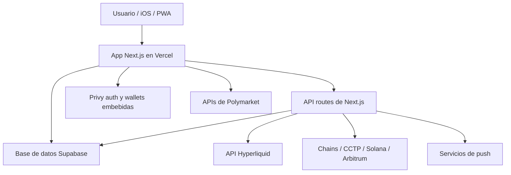
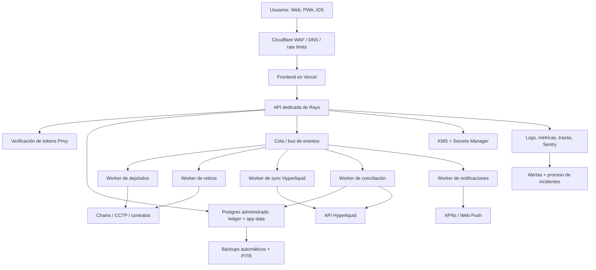
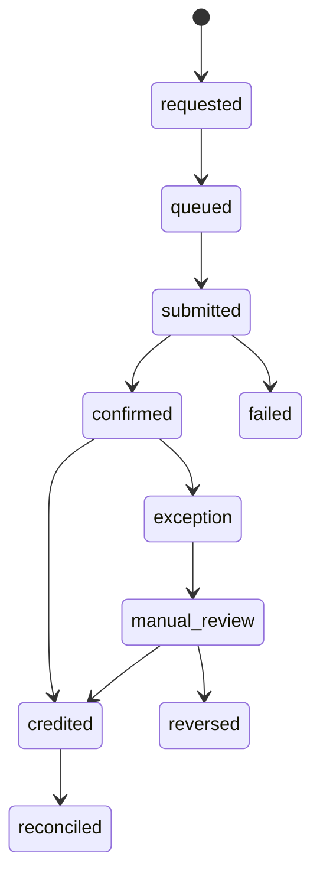

# Infraestructura y modelo de cumplimiento

Este documento describe la infraestructura objetivo de producción para Rayo. Es un plan de ingeniería, no asesoría legal. Antes de un lanzamiento público con flujos de dinero real, la arquitectura final debe revisarse con abogados, asesores fiscales/contables y especialistas regulatorios de los mercados donde Rayo vaya a operar.

Última revisión: 2026-06-15.

## Resumen ejecutivo

Supabase y Vercel son aceptables para la etapa actual del producto, sobre todo para frontend, páginas públicas, iteración rápida, datos de usuario no críticos y bajo costo operativo. No deberían ser el único plano de control a largo plazo para movimientos de fondos, jobs sensibles, evidencia de auditoría, ledger financiero o procesos de cumplimiento.

Recomendación objetivo:

- Mantener **Vercel** para el frontend web y páginas públicas.
- Mover APIs sensibles, orquestación de depósitos/retiros, conciliación y jobs programados a un backend dedicado.
- Mover el ledger crítico y la base operativa a Postgres administrado en una cuenta cloud propia, por ejemplo AWS Aurora/RDS o GCP Cloud SQL.
- Agregar workers con colas para depósitos, retiros, sincronización con Hyperliquid, notificaciones y conciliación.
- Usar KMS/secrets, logs de auditoría append-only, WAF/rate limiting, alertas, backups y runbooks formales.

## Arquitectura actual

### Fortalezas

- Desarrollo rápido y despliegues simples.
- Vercel encaja muy bien para frontend, CDN, previews y routing de Next.js.
- Supabase da Postgres, migraciones, primitivas compatibles con auth, RLS e iteración SQL rápida.
- Privy reduce la fricción de onboarding de wallets.
- Hyperliquid resuelve la capa de exchange, matching y estado de cuenta.

### Brechas principales

- Las API routes y cron jobs están demasiado pegados al ciclo de deploy del frontend.
- El acceso `service_role` a la base tiene demasiado radio de impacto si vive en rutas serverless generales.
- Los movimientos de fondos necesitan idempotencia, conciliación, colas, reintentos y revisión manual más fuertes.
- La evidencia de cumplimiento todavía no es un sistema de primera clase: revisiones de acceso, incidentes, retención, proveedores y auditoría necesitan dueños y almacenamiento.
- Monitoreo y runbooks deben tratarse como features de producción antes del lanzamiento público.

## Arquitectura objetivo

## Stack recomendado por defecto

Usar AWS salvo que exista una razón fuerte para estandarizar en otro cloud. GCP también sirve, pero AWS suele tener mejor superficie de cumplimiento, IAM/KMS maduro y más talento disponible.

| Capa | Recomendación | Motivo |
| --- | --- | --- |
| DNS/WAF | Cloudflare o AWS WAF | Rate limits, controles anti-bot, DDoS, reglas administradas |
| Frontend | Vercel | Mejor fit para UI Next.js, previews y CDN |
| Backend API | AWS ECS Fargate, App Runner o Lambda | Separar seguridad del frontend |
| Workers | ECS scheduled workers, consumidores Lambda o Temporal | Procesamiento async confiable con reintentos |
| Cola/eventos | SQS + EventBridge | Workflows idempotentes para dinero |
| Base de datos | Aurora Postgres o RDS Postgres | Controles cloud, PITR, replicas, IAM |
| Secretos | AWS Secrets Manager + KMS | Rotación, acceso con IAM, auditoría |
| Objetos | S3 | Evidencia, exports, reportes, logs inmutables |
| Observabilidad | Sentry + CloudWatch/OpenTelemetry | Errores de app + telemetría de infraestructura |
| Analítica | PostHog/warehouse más adelante | Separar analítica producto del ledger |

## Qué se queda en Vercel

- Páginas de marketing, legales, docs y la UI principal de trading.
- API handlers públicos o de lectura donde no haya secretos ni `service_role`.
- Preview deployments para iteración de producto.
- Routing same-origin para la web, siempre que las operaciones sensibles pasen por la API dedicada.

## Qué se mueve fuera de Vercel

- Acceso `service_role` a Supabase/Postgres.
- Orquestación de depósitos, retiros y transferencias spot/perp.
- Cron jobs que deban correr exactamente una vez o tener reintentos durables.
- Webhooks que muten balances o ledger.
- Operaciones admin, soporte, revisión manual y exports de cumplimiento.
- Cualquier ruta con credenciales privilegiadas de exchange, chain o base de datos.

## Modelo de base de datos

La base debe separar registros de producto del source of truth financiero.

### Tablas core

- `users`: perfil de usuario, subject de Privy, locale, flags de soporte.
- `wallet_accounts`: direcciones por usuario, chain y proveedor.
- `ledger_accounts`: cuentas contables internas, como spot, perp, pending_deposit, pending_withdrawal, fees, adjustments.
- `ledger_entries`: filas append-only de ledger de doble entrada.
- `money_movements`: movimientos visibles para el usuario: depósitos, retiros, transferencias spot/perp, ajustes y fallos.
- `movement_events`: eventos inmutables del ciclo de vida de cada movimiento.
- `chain_transactions`: txs observadas on-chain, confirmaciones y metadata decodificada.
- `exchange_events`: fills, transferencias, funding, retiros y snapshots de Hyperliquid.
- `reconciliation_runs`: comparaciones periódicas entre ledger interno, chain e Hyperliquid.
- `audit_events`: quién hizo qué, cuándo, desde dónde y por qué.

### Reglas del ledger

- Las entradas de ledger son append-only. No se actualizan ni borran entradas posteadas.
- Usar contabilidad de doble entrada: todo movimiento debita una cuenta y acredita otra.
- Guardar montos en unidades menores enteras, más `asset_id`, `decimals` y metadata de display.
- Exigir `idempotency_key` para cada operación externa.
- El estado visible del movimiento se deriva de eventos y postings, no de estado libre de UI.
- Los ajustes manuales requieren motivo, actor, ticket/referencia y doble aprobación cuando el volumen lo justifique.

### Ciclo de vida de un movimiento

## Controles para movimientos de dinero

### Depósitos

- Crear un `money_movements` durable antes de mostrar un depósito como pendiente.
- Observar confirmaciones on-chain desde workers, no solo desde polling del frontend.
- Acreditar el ledger únicamente después de confirmar chain, asset y monto.
- Conciliar contra balance Hyperliquid y ledger interno.
- Rechazar o marcar depósitos en chain incorrecta, token incorrecto, duplicados, dust o payloads malformados.

### Retiros

- Exigir autenticación fuerte y sesión fresca.
- Revalidar balance disponible del lado servidor.
- Crear intención de retiro con `idempotency_key`.
- Usar workers con cola para submit, reintentos y finalización.
- Aplicar límites de velocidad, allowlist/cooldown de direcciones y revisión manual por umbral.
- Guardar payload firmado exacto, tx hash, errores y eventos de liquidación final.

### Transferencias spot a perp

- Tratarlas como movimientos internos con postings de ledger.
- Separar optimismo de UI del estado liquidado.
- Conciliar siempre contra el estado de Hyperliquid.
- Soportar fallos parciales y caminos de reparación admin.

## Modelo de seguridad

### Fronteras de confianza

- Browser y mobile clients no son confiables.
- Vercel frontend es capa de presentación y routing.
- La API dedicada es la capa de enforcement de políticas.
- Workers son los únicos sistemas que mutan estado financiero a partir de eventos externos.
- Roles de base de datos se separan por workload, no se comparten globalmente.

### Controles requeridos

- Rotar inmediatamente el token de acceso de Supabase que fue pegado en chat y sacarlo de logs/superficies visibles.
- Mantener `service_role` fuera del frontend y fuera de rutas Next.js generales.
- Usar secretos separados por ambiente: local, preview, staging, producción.
- Usar roles de base con mínimo privilegio para API, workers, analítica read-only y soporte.
- Mantener RLS para queries user-facing; hacer writes privilegiados solo desde servicios/server functions.
- Agregar IP/rate limits a login, trading, depósito, retiro y soporte.
- Agregar logs estructurados con redacción de secretos y request IDs estables.
- Alertar sobre retiros fallidos, drift de conciliación, picos de login y cambios de políticas de base.
- Exigir MFA/SSO en cloud, Supabase, Vercel, Privy, Hyperliquid/admin y GitHub.

## Programa de cumplimiento

Rayo debe tratar cumplimiento como disciplina operativa, no solo documentos.

### Checklist mínimo para launch

- Términos, privacidad y advertencias de riesgo publicados y versionados.
- Consentimiento capturado con versión de política y timestamp.
- Política de retención para usuarios, logs, soporte y registros financieros.
- Inventario de proveedores: Vercel, Supabase, Privy, Hyperliquid, cloud provider, analytics, error tracking.
- Proceso de revisión de accesos a producción.
- Runbook de incidentes con owners, severidades y plantillas de comunicación.
- Evidencia de backup y restore test.
- Reportes de conciliación guardados de forma inmutable.
- Acciones de soporte/admin registradas en `audit_events`.

### Preguntas regulatorias para abogados

- Si Rayo es solo interfaz, servicio tipo introducing broker, money transmitter u otro actor regulado en cada jurisdicción objetivo.
- Si aplican obligaciones KYC/AML por depósitos, retiros, custodia, routing, jurisdicción o relaciones comerciales.
- Si acciones tokenizadas/perpetuos disparan restricciones de securities, derivatives, CFD o leverage retail.
- Si deben bloquearse usuarios de jurisdicciones restringidas.
- Qué disclosures exactos se requieren sobre riesgo, liquidación, apalancamiento y comisiones.
- Obligaciones fiscales o reportes, si existen.

## Postura de proveedores

Las certificaciones de proveedores ayudan, pero no hacen que Rayo sea compliant por sí solas. Son insumos dentro del ambiente de control propio de Rayo.

Referencias revisadas el 2026-06-15:

- Supabase SOC 2: https://supabase.com/docs/guides/security/soc-2-compliance
- Supabase ISO 27001: https://supabase.com/blog/supabase-is-now-iso-27001-certified
- Vercel compliance: https://vercel.com/docs/security/compliance
- Vercel security: https://vercel.com/security
- AWS compliance programs: https://aws.amazon.com/compliance/programs/
- Google Cloud compliance reports: https://cloud.google.com/security/compliance/compliance-reports-manager

## Plan de migración

### Fase 0: hardening inmediato

- Rotar el token de Supabase que fue expuesto en chat.
- Confirmar que todos los secretos productivos viven solo en secret stores.
- Revisar variables de entorno en Vercel y borrar secretos no usados.
- Agregar backups productivos y restore drills en Supabase mientras siga en uso.
- Mantener las migraciones actuales de RLS y hardening de advisor.
- Documentar estados actuales de movimientos de dinero y modos de falla conocidos.

### Fase 1: frontera de API dedicada

- Crear `api.rayotrade.xyz` como backend separado.
- Mover operaciones con `service_role` fuera de Vercel route handlers.
- Agregar request IDs, logs estructurados, auth middleware y rate limits.
- Validar tokens de Privy del lado servidor antes de operaciones privilegiadas.
- Mantener frontend en Vercel y apuntar builds iOS a `NEXT_PUBLIC_API_BASE`.

### Fase 2: ledger y base de datos

- Crear Postgres administrado en AWS/GCP con PITR y red privada.
- Migrar tablas críticas: users, wallets, ledger, movements, audits, reconciliation.
- Dejar Supabase temporalmente solo para datos públicos o de producto de bajo riesgo si conviene.
- Agregar replicas read-only o exports analíticos cuando el volumen lo exija.
- Agregar revisión estricta de migraciones para tablas financieras.

### Fase 3: workers y colas

- Agregar workers con cola para depósitos, retiros, transferencias, notificaciones y conciliación.
- Agregar `idempotency_key` y políticas de retry a cada operación externa.
- Agregar dead-letter queues para revisión manual.
- Agregar jobs programados de conciliación con thresholds y alertas explícitas.

### Fase 4: seguridad y observabilidad

- Agregar WAF/rate limits delante de frontend y API.
- Centralizar logs, métricas, trazas y alertas de Sentry.
- Agregar audit logs admin y tooling de soporte.
- Agregar políticas IAM, MFA, cuentas break-glass y revisiones de acceso.
- Agregar almacenamiento inmutable para evidencia y reportes.

### Fase 5: readiness de cumplimiento

- Finalizar entidad legal, políticas, términos y estrategia jurisdiccional.
- Preparar carpeta de due diligence de proveedores.
- Correr tabletop de respuesta a incidentes.
- Correr prueba de restore y drill de conciliación.
- Decidir postura KYC/geofencing antes de escalar adquisición paga.

## Tickets de ingeniería

1. Rotar el token Supabase filtrado y auditar todos los tokens Supabase activos.
2. Crear servicio `api.rayotrade.xyz` con health check y auth middleware.
3. Mover writes de movimientos de dinero detrás de la API dedicada.
4. Agregar tablas append-only de ledger y helpers de doble entrada.
5. Agregar cola/event bus y worker de confirmación de depósitos.
6. Agregar workflow de intención de retiro con idempotencia y límites de velocidad.
7. Agregar worker de conciliación entre ledger, Hyperliquid y chain.
8. Agregar `audit_events` para acciones privilegiadas de soporte.
9. Agregar alertas productivas para fallos de movimientos y drift de conciliación.
10. Agregar runbook de backup/restore y evidencia del primer restore test.
11. Agregar inventario de proveedores y checklist de revisión de accesos.
12. Crear ambiente staging que replique secrets, shape de base y workers de producción.

## Decision record

Decisión recomendada: mantener Vercel para frontend, mantener Supabase solo como acelerador de corto plazo y mover el plano de control financiero a un backend dedicado con Postgres cloud-owned y workers antes de un lanzamiento público amplio.

Esto permite que Rayo pase de MVP a producción sin tirar la app actual. También crea la evidencia necesaria para partners serios, auditorías y conversaciones regulatorias.
