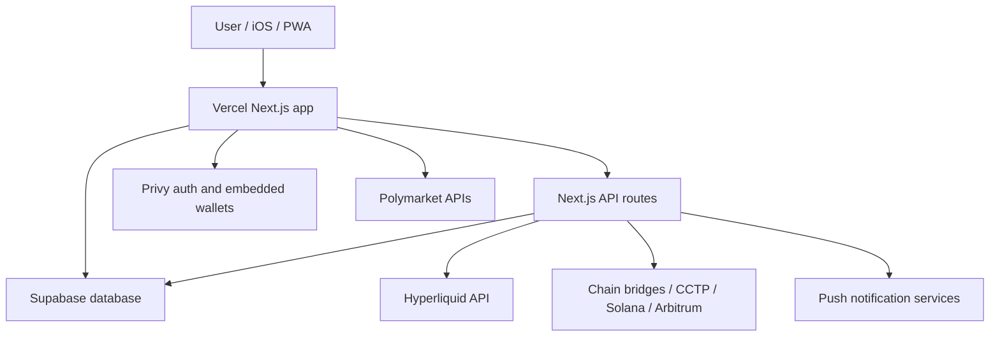
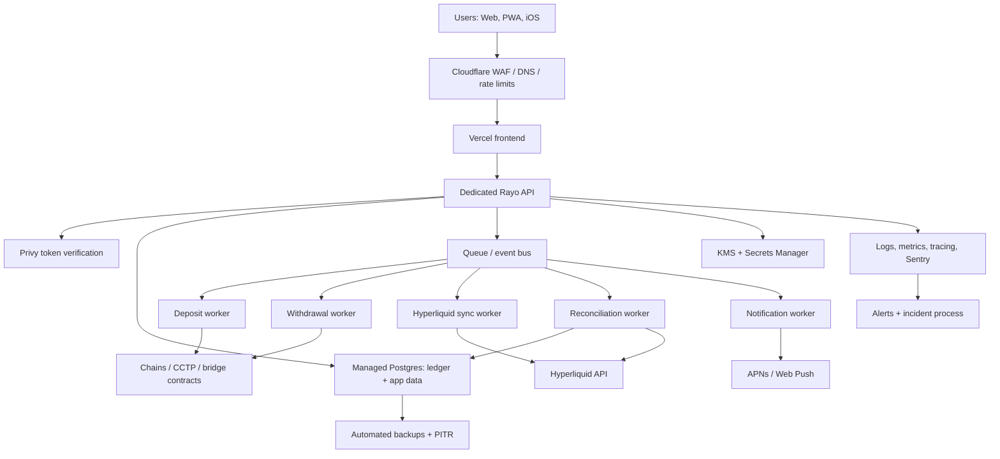
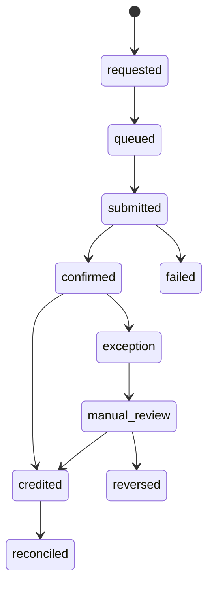

# Infrastructure and Compliance Model

This document describes the target production infrastructure for Rayo. It is written as an engineering plan, not legal advice. Before a public launch with real money flows, review the final architecture with counsel, tax/accounting advisors, and any required regulatory specialists for the markets where Rayo will operate.

Last reviewed: 2026-06-15.

## Executive Summary

Supabase and Vercel are acceptable for the current product stage, especially for frontend delivery, auth-adjacent user data, quick iteration, and low operational overhead. They should not become the only long-term control plane for funds movement, sensitive backend jobs, audit evidence, financial ledgers, or compliance workflows.

Recommended target:

- Keep **Vercel** for the web frontend and lightweight public pages.
- Move sensitive API routes, fund movement orchestration, reconciliation, and scheduled jobs into a dedicated backend service.
- Move the critical ledger and operational database into cloud-owned managed Postgres, such as AWS Aurora/RDS or GCP Cloud SQL.
- Add queue-backed workers for deposits, withdrawals, Hyperliquid sync, notifications, and reconciliation.
- Use cloud KMS/secrets, append-only audit logs, WAF/rate limiting, alerting, backups, and formal incident/runbook processes.

## Current Architecture

### Strengths

- Fast development loop and simple deployments.
- Vercel is excellent for frontend hosting, CDN delivery, preview deployments, and Next.js routing.
- Supabase gives Postgres, migrations, auth-compatible primitives, RLS, and quick SQL iteration.
- Privy reduces wallet onboarding friction.
- Hyperliquid handles the exchange layer, matching, and account state.

### Main Gaps

- API routes and scheduled jobs are too close to the frontend deployment lifecycle.
- Service-role database access has a higher blast radius when used from general serverless routes.
- Fund movements need stronger idempotency, reconciliation, queueing, and manual review tooling.
- Compliance evidence is not yet a first-class system: access reviews, incident logs, retention, vendor inventory, and audit trails need owners and storage.
- Monitoring and runbooks should be treated as production features before public launch.

## Target Architecture

## Recommended Default Stack

Use AWS unless there is a strong reason to standardize on another cloud. GCP is also fine, but AWS has the broadest compliance surface and hiring familiarity.

| Layer | Recommended default | Why |
| --- | --- | --- |
| DNS/WAF | Cloudflare or AWS WAF | Rate limits, bot controls, DDoS protection, managed rules |
| Frontend | Vercel | Best fit for Next.js UI, previews, CDN |
| API backend | AWS ECS Fargate, App Runner, or Lambda | Separate security boundary from frontend |
| Workers | ECS scheduled workers, Lambda consumers, or Temporal | Reliable async processing and retries |
| Queue/event bus | SQS + EventBridge | Idempotent money movement workflows |
| Database | Aurora Postgres or RDS Postgres | Cloud-owned controls, PITR, replicas, IAM integration |
| Secrets | AWS Secrets Manager + KMS | Rotation, IAM-scoped access, audit trail |
| Object storage | S3 | Evidence, exports, reports, immutable logs |
| Observability | Sentry + CloudWatch/OpenTelemetry | App errors plus infrastructure telemetry |
| Analytics | PostHog/warehouse later | Keep product analytics away from the money ledger |

## What Stays on Vercel

- Marketing pages, legal pages, docs, and the main trading UI.
- Read-heavy public API handlers where no secrets or service-role database keys are needed.
- Preview deployments for product iteration.
- Same-origin routing for the web app, as long as sensitive operations proxy to the dedicated API.

## What Moves Off Vercel

- Service-role Supabase/Postgres access.
- Deposit, withdrawal, spot-to-perp transfer, and reconciliation orchestration.
- Cron jobs that must run exactly once or require durable retry semantics.
- Webhook handlers that mutate balances or ledger state.
- Admin operations, support tools, manual review, and compliance exports.
- Any route that holds privileged exchange, chain, or database credentials.

## Database Model

The database should separate user-facing records from the financial source of truth.

### Core Tables

- `users`: app user profile, Privy subject, locale, support flags.
- `wallet_accounts`: user wallet addresses by chain and provider.
- `ledger_accounts`: internal accounting accounts, such as spot, perp, pending_deposit, pending_withdrawal, fees, adjustments.
- `ledger_entries`: append-only double-entry ledger rows.
- `money_movements`: user-visible movement objects for deposits, withdrawals, spot/perp transfers, adjustments, and failed movements.
- `movement_events`: immutable lifecycle events for each movement.
- `chain_transactions`: observed chain txs, confirmations, decoded transfer metadata.
- `exchange_events`: observed Hyperliquid fills, transfers, funding, withdrawals, and balance snapshots.
- `reconciliation_runs`: periodic comparison of internal ledger, chain state, and Hyperliquid state.
- `audit_events`: who did what, when, from where, and why.

### Ledger Rules

- Ledger entries are append-only. Never update or delete posted entries.
- Use double-entry accounting: every movement debits one account and credits another.
- Store amounts in integer minor units, plus `asset_id`, `decimals`, and display metadata.
- Require an idempotency key for every external operation.
- User-visible movement status is derived from events and ledger postings, not free-form UI state.
- Manual adjustments require reason, actor, ticket/reference, and dual-control approval once volume justifies it.

### Example Movement Lifecycle

## Money Movement Controls

### Deposits

- Generate a durable `money_movements` record before showing a deposit as pending.
- Watch chain confirmations through worker-owned infrastructure, not frontend polling alone.
- Credit the ledger only after required confirmations and asset/chain validation.
- Reconcile against Hyperliquid account balance and internal ledger.
- Reject or flag wrong-chain, wrong-token, duplicate, dust, and malformed deposits.

### Withdrawals

- Require strong user authentication and fresh session checks.
- Recheck available balance server-side.
- Create withdrawal intent with idempotency key.
- Use queue-backed workers for submission, retry, and finalization.
- Apply velocity limits, address allowlists or cooldowns, and manual review thresholds.
- Store exact signed payloads, tx hashes, errors, and final settlement events.

### Spot to Perp Transfers

- Treat spot/perp transfers as internal money movements with ledger postings.
- Separate UI optimism from settled ledger state.
- Always reconcile against Hyperliquid account state.
- Support partial failure states and admin repair paths.

## Security Model

### Trust Boundaries

- Browser and mobile clients are untrusted.
- Vercel frontend is a presentation and routing layer.
- Dedicated API is the policy enforcement layer.
- Workers are the only systems allowed to mutate financial state after external events.
- Database roles are scoped by workload, not shared globally.

### Required Controls

- Rotate the exposed Supabase access token immediately and remove it from all chat/log surfaces.
- Keep service-role keys out of the frontend project and out of general-purpose Next.js routes.
- Use separate secrets per environment: local, preview, staging, production.
- Use least-privilege database roles for API, workers, read-only analytics, and support.
- Enforce RLS for user-facing queries; do privileged writes only through server-owned functions/services.
- Add IP/rate limits to login, trading, deposit, withdrawal, and support routes.
- Add structured logs with secret redaction and stable request IDs.
- Add alerting on failed withdrawals, reconciliation drift, abnormal login spikes, and database policy changes.
- Require MFA/SSO on cloud, Supabase, Vercel, Privy, Hyperliquid/admin, and GitHub accounts.

## Compliance Program

Rayo should treat compliance as operating discipline, not only documents.

### Minimum Launch Checklist

- Terms, privacy policy, and risk disclosures published and versioned.
- Consent capture tied to policy version and timestamp.
- Data retention policy for users, logs, support records, and financial records.
- Vendor inventory: Vercel, Supabase, Privy, Hyperliquid, cloud provider, analytics, error tracking.
- Access review process for production systems.
- Incident response runbook with owners, severity levels, and communication templates.
- Backup and restore test evidence.
- Reconciliation reports stored immutably.
- Support/admin actions logged in `audit_events`.

### Regulatory Questions for Counsel

- Whether Rayo is purely an interface, an introducing broker-like service, a money transmitter, or another regulated actor in each target jurisdiction.
- Whether any KYC/AML obligations apply based on deposits, withdrawals, custody, routing, jurisdiction, or affiliate relationships.
- Whether tokenized stocks/perpetuals trigger securities, derivatives, CFD, or retail leverage restrictions.
- Whether users from restricted jurisdictions must be blocked.
- Required risk, liquidation, leverage, and fee disclosures.
- Tax reporting obligations, if any.

## Provider Posture

Vendor certifications help, but they do not make the app compliant by themselves. They are inputs into Rayo's own control environment.

References reviewed on 2026-06-15:

- Supabase SOC 2: https://supabase.com/docs/guides/security/soc-2-compliance
- Supabase ISO 27001: https://supabase.com/blog/supabase-is-now-iso-27001-certified
- Vercel compliance: https://vercel.com/docs/security/compliance
- Vercel security: https://vercel.com/security
- AWS compliance programs: https://aws.amazon.com/compliance/programs/
- Google Cloud compliance reports: https://cloud.google.com/security/compliance/compliance-reports-manager

## Migration Plan

### Phase 0: Immediate Hardening

- Rotate the Supabase access token that was pasted into chat.
- Confirm all production secrets are only in provider secret stores.
- Review Vercel environment variables and remove unused secrets.
- Add production backups and restore drills for Supabase until migration.
- Keep the current Supabase RLS migrations and advisor hardening in place.
- Document current money movement states and all known failure modes.

### Phase 1: Dedicated API Boundary

- Create `api.rayotrade.xyz` as a separate backend service.
- Move service-role database operations out of Vercel route handlers.
- Add request IDs, structured logs, auth middleware, and rate limits.
- Validate Privy tokens server-side before privileged operations.
- Keep the frontend on Vercel and point iOS builds to `NEXT_PUBLIC_API_BASE`.

### Phase 2: Ledger and Database Upgrade

- Create managed Postgres in AWS/GCP with PITR and private networking.
- Migrate critical tables: users, wallets, ledger, movements, audits, reconciliation.
- Keep Supabase temporarily for low-risk public or product data only if useful.
- Add read replicas or analytics exports once volume requires it.
- Add strict migration review for financial tables.

### Phase 3: Workers and Queues

- Add queue-backed deposit, withdrawal, transfer, notification, and reconciliation workers.
- Add idempotency keys and retry policies to every external operation.
- Add dead-letter queues for manual review.
- Add scheduled reconciliation jobs with explicit thresholds and alerts.

### Phase 4: Security and Observability

- Add WAF/rate limits in front of frontend and API.
- Add central logging, metrics, traces, and Sentry alerts.
- Add admin audit logs and support tooling.
- Add cloud IAM policies, MFA enforcement, break-glass accounts, and access reviews.
- Add immutable storage for compliance evidence and reports.

### Phase 5: Compliance Readiness

- Finalize legal entity, policies, user terms, and jurisdiction strategy.
- Prepare vendor due diligence folder.
- Run tabletop incident response.
- Run backup restore and reconciliation drill.
- Decide KYC/geofencing posture before scaling paid acquisition.

## Engineering Tickets

1. Rotate leaked Supabase token and audit all active Supabase tokens.
2. Create `api.rayotrade.xyz` backend repo/service with health check and auth middleware.
3. Move money movement write operations behind the dedicated API.
4. Add append-only ledger tables and double-entry posting helpers.
5. Add queue/event bus and a worker for deposit confirmation.
6. Add withdrawal intent workflow with idempotency and velocity limits.
7. Add reconciliation worker comparing ledger, Hyperliquid, and chain state.
8. Add admin audit events for all privileged support actions.
9. Add production alert rules for movement failures and reconciliation drift.
10. Add backup restore runbook and first restore test evidence.
11. Add vendor inventory and access review checklist.
12. Create staging environment that mirrors production secrets, database shape, and workers.

## Decision Record

Recommended decision: keep Vercel for the frontend, keep Supabase only as a short-term accelerator, and move the financial control plane to a dedicated backend plus cloud-owned Postgres and workers before a broad public launch.

This gives Rayo a clean path from MVP to production without throwing away the current app. It also creates the evidence trail needed for serious partners, audits, and regulatory conversations.
